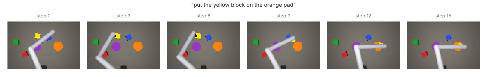
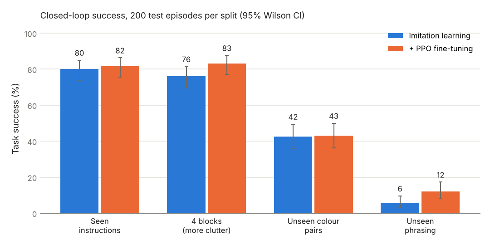

# vla-pick-place

A vision-language-action (VLA) policy that controls a simulated SCARA robot arm from a camera image and a
natural-language instruction such as *"put the yellow block on the orange pad"*. It is trained by imitation
learning, fine-tuned with reinforcement learning (PPO), benchmarked for task success, generalisation and safety,
and deployed through a dependency-free C++17 inference runtime.



## Results

Closed-loop success on held-out test layouts (seeds never used for data collection, training or model
selection), 200 episodes per split, 95% Wilson confidence intervals:

| Test split | Imitation learning | + PPO fine-tuning (released) | C++ runtime in the loop |
|---|---|---|---|
| Seen instructions | 80.0% [73.9, 85.0] | **81.5%** [75.5, 86.3] | 82.0% |
| 4 blocks on the table (training had at most 3) | 76.0% [69.6, 81.4] | **83.0%** [77.2, 87.6] | 83.5% |
| Colour pairs never used as a training target | 42.5% [35.9, 49.4] | 43.0% [36.3, 49.9] | 43.0% |
| New phrasing with out-of-vocabulary words | 5.5% [3.1, 9.6] | 12.0% [8.2, 17.2] | 12.0% |



Safety, released policy, seen split: no block released outside the target pad, no distractor block disturbed,
and the safety filter corrected the command on 8.8% of steps (speed, joint and quill-travel limits).

Inference latency per control step, batch size 1, same CPU, median of 1,000 calls (`results/latency.json`):

| Runtime | 1 thread | 2 threads |
|---|---|---|
| C++17 runtime (no dependencies, 2.7 MB weights) | 6.5 ms | 4.5 ms |
| PyTorch (oneDNN kernels) | 3.5 ms | 2.9 ms |

The C++ runtime reproduces PyTorch's outputs to within 3.8e-6 on real simulator observations. It is 1.6-1.9x
slower than PyTorch's hand-tuned kernels, but needs no Python and runs 15x inside the 100 ms control period.

**What the numbers say.** The policy solves most tasks with phrasings and colour combinations it was trained on,
and it holds up with more clutter than it saw in training. RL fine-tuning helps most under that extra clutter
(+7 points); on seen tasks its gain is within noise. Compositional generalisation is the weak point: colour pairs
never seen together succeed 43% of the time, and new phrasings mostly fail. See *Limitations*.

## How it works

**Simulation** (`vla/env.py`). MuJoCo model of a SCARA arm: two revolute joints, a vertical quill and a suction
cup, driven by torque-limited position actuators at 10 Hz. A fixed overhead camera renders 64x96 RGB images.
Each episode places 2-4 coloured blocks and two coloured pads and samples an instruction from four templates.
Every command passes a safety filter that enforces per-step speed limits, joint limits and quill travel.

**Expert demonstrations** (`vla/expert.py`, `vla/data.py`). A scripted controller with privileged state uses
analytic inverse kinematics and a continuous "funnel" descent profile. It succeeds in 100% of noise-free episodes.
1,800 demonstrations were collected with DART-style noise injection: the executed action is perturbed, but the
label is the expert's clean action at the visited state, so the policy learns to recover from its own errors.
1,799 succeeded and were kept (40,170 frames).

**Policy** (`vla/model.py`, 666k parameters). Inputs are the camera image, the instruction and the joint state.

* A CoordConv stem (RGB plus x/y coordinate channels, two stride-2 convolutions) gives a 16x24 feature map.
* Language-conditioned keypoints. FiLM modulates the feature map with the instruction, and a spatial softmax
  returns precise image coordinates for the named block, the named pad and the end of the arm.
* A pre-norm Transformer encoder (4 layers, 4 heads, width 128) reads 111 tokens: an action query, joint state,
  keypoints, instruction words and an 8x12 grid of scene features.
* The action token is decoded into a chunk of the next 4 actions. At run time only the first one is executed
  (receding horizon).

**Imitation learning** (`vla/train_bc.py`). Behaviour cloning on action chunks plus an auxiliary keypoint loss.
The keypoint labels are simulator positions projected through the camera model; they are used in training only.
Trained with PyTorch DistributedDataParallel on 2 processes (gloo backend) for 14 epochs, about 39 minutes on CPU.

**RL fine-tuning** (`vla/rl.py`). PPO on top of the behaviour-cloned policy, with three stabilising choices:

* An asymmetric actor-critic: the critic sees privileged simulator state, while the actor still sees only camera,
  instruction and joints.
* A penalty that anchors the action means to the frozen imitation policy.
* Potential-based reward shaping, plus penalties for wrong placements, disturbed distractors and safety-filter
  interventions.

Checkpoints are selected by deterministic validation on separate seeds, with the imitation policy as the
baseline. Validation success went from 83.3% to 91.7% (best at iteration 36 of 48). On the untouched test
layouts the gain is smaller (see Results), which is why model selection and testing use different seeds.

**C++ runtime** (`cpp/`). A C++17 library with no dependencies (OpenMP optional):

* A versioned binary weight format, with input validation that rejects truncated files and bad token ids.
* im2col convolutions and a register-blocked GEMM kernel (4 rows per pass, contiguous fused multiply-add loops).
* Per-head attention on the same kernel.
* A last-layer shortcut: only the action token's row is computed, with keys and values still taken from all
  tokens, so outputs are unchanged.
* A pybind11 binding, so the closed-loop benchmark can run with the C++ policy in the loop.

## What went wrong on the way (and how it was found)

The first three training runs reached 0-5% success. Closed-loop traces showed why: the policy switched the suction
on 40-50 cm away from the block. It explained only about 20% of the variance in the elbow joint's actions, so it had
not learned where the named block was. Four changes fixed it, each checked with a measurement first:

1. **A smooth expert.** The original expert switched abruptly between "move" and "descend". A regression policy
   blurs such boundaries and descends too early.
2. **No image-shift augmentation.** The camera is fixed and the task depends on absolute positions, so shifting
   images by up to 3 px moved objects by up to about 3 cm relative to their true positions.
3. **A finer, language-conditioned keypoint branch.** The scene tokens cover about 9 cm per cell, too coarse
   to pinpoint a block.
4. **Heatmap supervision.** The keypoints are now trained with cross-entropy against the projected pixel, not
   regression through the soft-argmax. A perception-only probe showed the effect: localisation error after
   1,000 steps fell from about 15-20 cm to 1.4 px (about 1.5 cm) for the block and 0.5 px for the pad.

Success at epoch 3 then went from 5% to 35%; the final imitation policy reaches 80%.

## Limitations

* **Compositional language generalisation is weak** (43% on unseen colour pairs, 12% on new phrasings). The FiLM
  branch appears to learn pair-specific features, and unknown words shift the mean instruction embedding.
  Planned next steps: word dropout and synonym augmentation, a pretrained text encoder, and per-word attention for
  FiLM instead of the mean embedding.
* The simulation is planar with top-down picking, and suction is a kinematic attachment rather than contact-rich
  grasping. Images are rendered without noise or lighting changes. The policy has not been run on hardware.
* Imitation data comes from a privileged scripted expert, not human teleoperation.
* The model is small (666k parameters) and trained from scratch, not adapted from a pretrained VLM.

## Run it

```bash
sudo apt-get install -y libosmesa6                 # software OpenGL for MuJoCo rendering
pip install torch --index-url https://download.pytorch.org/whl/cpu
pip install -e ".[dev]"
cmake -S cpp -B cpp/build -DVLA_BUILD_PYTHON=ON -DPython_EXECUTABLE=$(which python)
cmake --build cpp/build -j

pytest -q                                           # 31 Python tests
ctest --test-dir cpp/build --output-on-failure      # C++ parity and validation tests

# Benchmark the released policy (PyTorch, then the C++ runtime in the loop)
python -m vla.evaluate --checkpoint checkpoints/rl_policy.pt --episodes 200
PYTHONPATH=cpp/build python -m vla.evaluate --backend cpp --weights checkpoints/policy.bin --episodes 200

./scripts/reproduce.sh                               # whole pipeline: data -> BC -> PPO -> export -> benchmarks
```

Docker: `docker build -t vla-pick-place . && docker run --rm vla-pick-place` builds the C++ runtime and runs the
benchmark with it.

## Repository layout

```
vla/
  env.py          MuJoCo SCARA environment, camera model, safety filter
  expert.py       scripted expert (IK + continuous funnel controller)
  language.py     instruction templates, train/held-out splits, tokenizer
  data.py         noise-injected demonstration collection, action-chunk dataset
  model.py        VLA Transformer with FiLM spatial-softmax keypoints
  train_bc.py     behaviour cloning (single process or DistributedDataParallel)
  rl.py           PPO fine-tuning with asymmetric critic and validation-based selection
  evaluate.py     closed-loop benchmark: success, generalisation splits, safety metrics
  export.py       binary weight export and parity fixtures for C++
cpp/              C++17 runtime, benchmark, tests, pybind11 binding
configs/          training configurations
checkpoints/      released policies (PyTorch and C++ formats)
results/          benchmark outputs, training histories, figures
tests/            pytest suite
```
